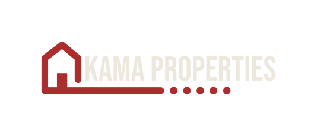
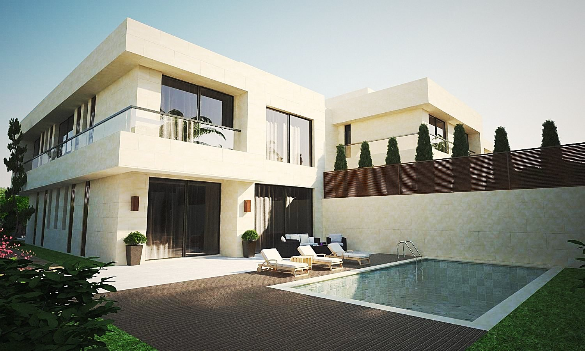
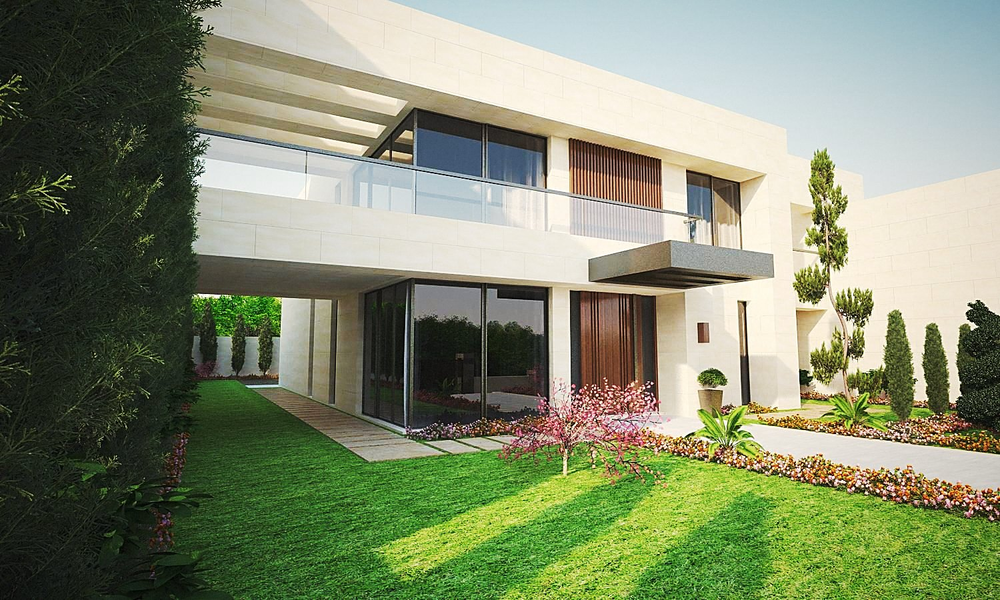
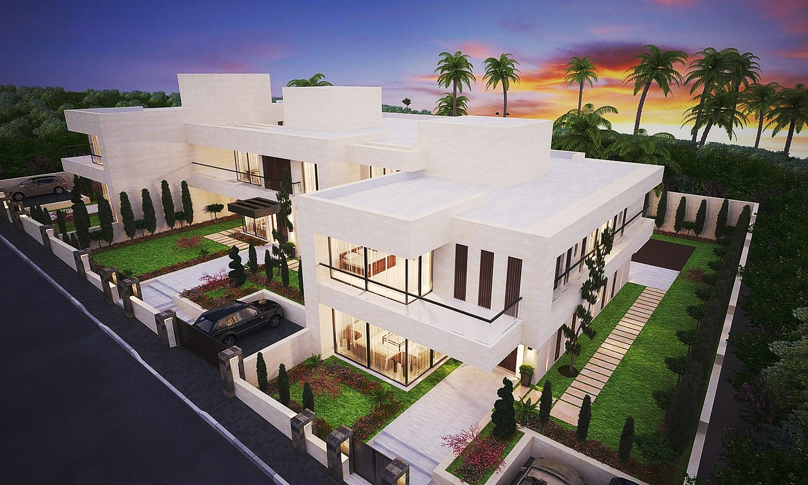
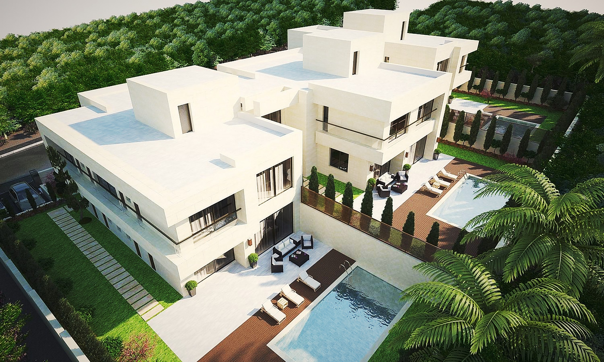
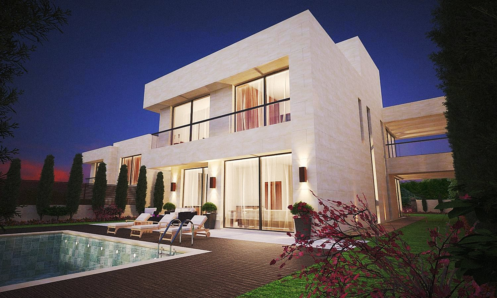
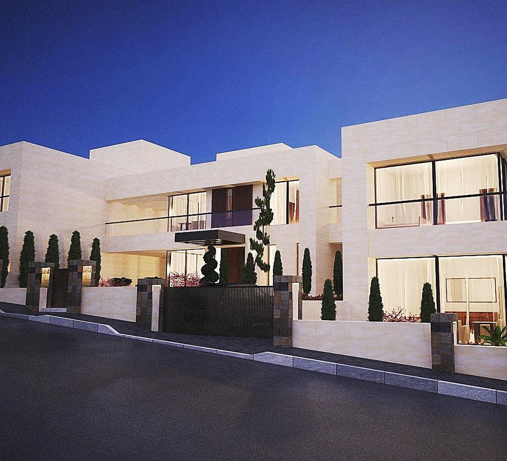
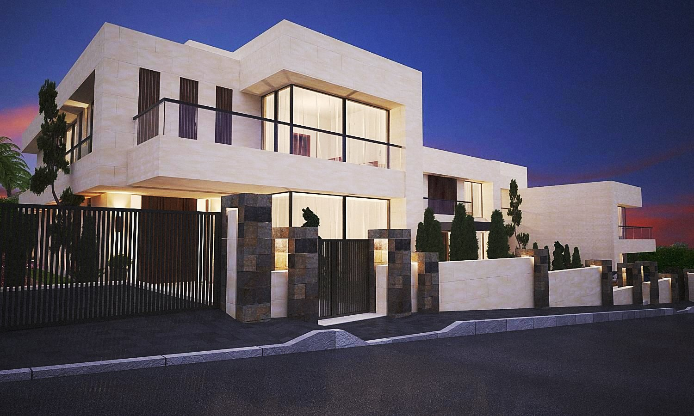

<!DOCTYPE html>
<html lang="ar" dir="rtl">
<head>
<meta charset="UTF-8">
<meta name="viewport" content="width=device-width, initial-scale=1.0">
<title>كاما العقارية — حِمى | ملاذ من ثلاث فلل، عمّان</title>
<meta name="description" content="حِمى من كاما العقارية: ثلاث فلل خاصة تطل على غابة من الأشجار على أطراف عمّان. بعيدة، وقريبة.">
<link rel="preconnect" href="https://fonts.googleapis.com">
<link rel="preconnect" href="https://fonts.gstatic.com" crossorigin>
<link href="https://fonts.googleapis.com/css2?family=IBM+Plex+Sans+Arabic:wght@300;400;500;600&family=Marcellus&display=swap" rel="stylesheet">
<link rel="stylesheet" href="css/style.css">
<link rel="stylesheet" href="css/v2.css">
<link rel="icon" type="image/svg+xml" href="assets/logo-original.svg">
</head>
<body class="v2">
<a class="skip" href="#hima">تجاوز إلى المحتوى</a>

  
<i></i><i></i><i></i><i></i><i></i>

  
KAMA

<header class="site-header">
  

    
    

      <a class="lang-toggle" href="index.html" lang="en">English</a>
      <button class="menu-btn" aria-expanded="false" aria-controls="overlay-menu">
        القائمة
        
      </button>
    

  

</header>

  

    <nav aria-label="القائمة الرئيسية">
      <a href="index-ar.html">الرئيسية</a>
      <a href="about-ar.html">من نحن</a>
      <a href="projects-ar.html">الفلل</a>
      <a href="contact-ar.html">اتصل بنا</a>
      <a href="index-ar.html#interest">سجّل اهتمامك</a>
    </nav>
    

      للاستفسار
      info@kamaproperties.net 
      عمّان، الأردن  
      الدوام
      الأحد – الخميس، 9:00 – 18:00
    

  

<section class="cinema" id="top" aria-label="حِمى — مجمّع خاص من ثلاث فلل">
  

  

  

  

  

  <canvas class="cinema-atmo" aria-hidden="true"></canvas>
  

    <h1>بيوت تليق بعمّان.</h1>
    
ثلاث فلل خاصة فوق غابة من الأشجار. هدوء الطبيعة، والمدينة على بُعد دقائق.

    

      <a class="btn btn-primary" href="#interest">سجّل اهتمامك</a>
      <a class="btn btn-ghost" href="#hima">اكتشف حِمى</a>
    

  

  <a class="cinema-scroll" href="#hima">اكتشف</a>
  

    <button aria-label="المشهد 1"></button><button aria-label="المشهد 2"></button><button aria-label="المشهد 3"></button><button aria-label="المشهد 4"></button>
  

</section>

  

    حِمى <i></i> Hima <i></i> بعيدة، وقريبة <i></i> ملاذ من ثلاث فلل <i></i> عمّان <i></i>
    حِمى <i></i> Hima <i></i> بعيدة، وقريبة <i></i> ملاذ من ثلاث فلل <i></i> عمّان <i></i>
  

<section class="section section--paper" id="hima">
  

    
<i></i><i></i><i></i><i></i><i></i>

    

      

        
حِمى · Hima

        <h2>مكان مصون. اسمًا ووعدًا.</h2>
        
«الحِمى» في العربية هو أرضٌ تُصان طبيعتها ولا تُمسّ. هو اسم باكورة مشاريعنا، والمعيار الذي يقف خلفها: بيوت قليلة، تُبنى كما يجب، في مكان يستحق أن يُصان.

      

      

    

  

  

    

0

فلل خاصة

    

0<small> م²</small>

من البناء المتقن

    

0

شارع هادئ تتشاركه ثلاث عائلات

  

</section>

<section class="setting-band" id="setting">
  

  

    
الموقع

    <h2 class="reveal">بعيدة، وقريبة.</h2>
    
يطل المجمّع على غابة من الأشجار — صباحات من الخضرة وزقزقة العصافير، وأمسيات تحت سماء هادئة، وعمّان على بُعد دقائق. الصور لا توفي المشهد حقه؛ هذا مكان يجب أن تقف فيه بنفسك.

    
<a class="btn btn-primary" href="#interest">احجز زيارة خاصة</a>

  

</section>

<section class="section section--deep">
  

    
<i></i><i></i><i></i><i></i><i></i>

    
الفلل

    <h2 class="reveal">ثلاث فلل. معيار واحد.</h2>
  

  

    

      <article class="card">
        

A

<b>الفيلا الركنية</b>632 م² · 3 طوابق · مسبح وحديقة

      </article>
      <article class="card">
        

B

<b>الفيلا الوسطى</b>694 م² · 3 طوابق · مسبح وفناء

      </article>
      <article class="card">
        

C

<b>فيلا الحديقة</b>632 م² · 3 طوابق · مسبح وتراس

      </article>
    

    
اسحب · مرّر

  

</section>

<section class="section section--paper craft" id="craft">
  

    
الحِرفة

    <h2 class="reveal" style="margin-bottom:20px">جوهر الفخامة.</h2>
    

٠١
<h3>الحجر</h3>
واجهات من الحجر الأردني فوق هيكل مدروس، مع عزل حراري ومائي كامل كأساس — لا كإضافة.

    

٠٢
<h3>الأنظمة</h3>
تهيئة تكييف مركزي، وتمديدات منزل ذكي، ومرافق مستقلة لكل فيلا. العمل غير المرئي، منجزٌ بإتقان مرئي.

    

٠٣
<h3>التشطيب</h3>
تجهيزات أوروبية راقية، وحجر طبيعي وخشب في الداخل، وتسليم خالٍ من الملاحظات نقف خلفه بعد سكنك.

  

</section>

<section class="section section--ink quote-band quote-band--photo">
  

    
<i></i><i></i><i></i><i></i><i></i>

    <blockquote class="reveal">«البيت هو الشراء الوحيد الذي تُقدِم عليه العائلة بقلبها. نحن نبني كما لو كنّا نحن المشترين.»</blockquote>
    <cite class="reveal">كاما العقارية — عمّان</cite>
  

</section>

<section class="cta-panel" id="interest">
  
حِمى

  

    

      <h2>المشهد أجمل على الطبيعة.</h2>
      
سجّل اهتمامك وسيتواصل معك فريقنا شخصيًا.

      <ul class="promise">
        <li>رد خلال يوم عمل واحد</li>
        <li>المخططات والمساحات والأسعار — بإجابات واضحة</li>
        <li>زيارة خاصة لحِمى في الوقت الذي يناسبك</li>
        <li>بلا التزام، وبياناتك لا تُشارَك مع أي جهة</li>
      </ul>
    

    

    <form data-eoi action="https://formsubmit.co/info@kamaproperties.net" method="POST">
      <input type="hidden" name="_subject" value="New expression of interest — Hima v2 (AR)">
      <input type="hidden" name="_captcha" value="false">
      

        
<label for="v-name">الاسم الكامل</label><input id="v-name" name="name" type="text" autocomplete="name" required>

        
<label for="v-phone">الهاتف / واتساب</label><input id="v-phone" name="phone" type="tel" autocomplete="tel" required>

        
<label for="v-email">البريد الإلكتروني</label><input id="v-email" name="email" type="email" autocomplete="email" required>

        
<label for="v-villa">الفيلا التي تهمّك</label>
          <select id="v-villa" name="villa"><option>لم أقرر بعد</option><option>الفيلا A</option><option>الفيلا B</option><option>الفيلا C</option></select>
        

      

      

        <button class="btn btn-primary" type="submit">أرسل بياناتي</button>
      

    </form>
    
شكرًا لك — تم تسجيل اهتمامك، وسيتواصل معك فريقنا قريبًا.

    

  

</section>

<footer class="footer-v2">
  

    

    

      استكشف
      <a href="index-ar.html#hima">حِمى</a>
      <a href="index-ar.html#setting">الموقع</a>
      <a href="projects-ar.html">الفلل</a>
    

    

      تواصل
      <a href="mailto:info@kamaproperties.net" dir="ltr">info@kamaproperties.net</a>
      <a href="index-ar.html#interest">سجّل اهتمامك</a>
    

  

  
KAMA

  

    © 2026 كاما العقارية. عمّان، الأردن.
    kamaproperties.net
  

</footer>

</body>
</html>